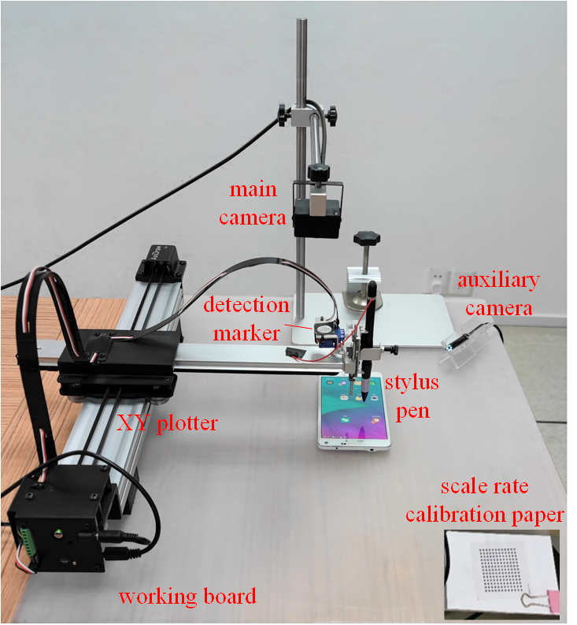

# The Test Execution Guide

This document provides a basic guide for how to set up a robotic testing environment for test script execution.

## 1. Setting up the Hardware Environment

### 1.1 The robotic testing device and its components

<div align="left">
  
</div>


The following table shows the main components of the robotic testing device.

| #  | Component         |  Specification    |
|:--:|:------------------|:-----------|
| 1  | working board | 40cmx60cmx8mm single-side frosted acrylic board (a table without obstructing objects also works) |
| 2  |  XY plotter   | AxiDraw V3 Personal Writing & Drawing Robot (EBB command compatible devices may also work) |
| 3 |   Stylus pen  |   active capacitive stylus pen with a rubber tip (need to be compatible with the touch screen)|
| 4   | calibration markers |     a white circular marker with a black background used for the initial pen position calibration |
|5  |  camera stand  |     any one for adjusting the position of the main camera |
| 6|    main camera |     a zoom camera with focus adjustable supporting over 1600x1200 resolution and over 30fps speed (e.g., EBS-800) |
| 7 |   auxiliary camera |   a fixed lens camera with over 1280x720 resolution used for touch depth detection |
| 8  |  scale rate calibration paper |  an HC050-1.5-13x12 calibration board with 13x12 dots, each is 1.5mm in diameter and has a 3mm distance to its neighbor |
| 9 |   fill light  |   an adjustable LED light used to fill light when the environment is dark|

### 1.2 Requirements on the robotic environments

#### (1) Fix the working table and the fill light to void vibration

#### (2) Carefully place the robotic arm and stylus pen

Place the robotic arm horizontally on the working board. Place the stylus pen at the end of the Y-axis of the robotic arm. If the robotic arm is not horizontally placed, it may introduce errors in the touch depth.

Some robotic arms may sink at one end due to gravity when positioned far from the support point. In this case, error correction for gravity\'s effect or a more stable robotic arm is necessary.

It is recommended that the robotic arm be fixed tightly with a clamp to prevent it from moving during testing.

#### (3) Adjust and fix the main camera

Adjust the support stand to ensure the main camera is vertically aligned with the working board and at a suitable height to prevent it from touching the stylus pen when performing test actions.

Adjust the camera, check the photo quality, and ensure that the objects on the working board are captured without distortion, with clear and stable images. If the camera imaging is tilted, it may cause trapezoidal distortion, affecting the conversion from pixel to physical distance and leading to abnormal touch interactions.

The camera should be securely fixed to avoid being affected by vibrations caused by the robotic arm executing touch actions. If necessary, place the camera in a separate location, not on the same working board.

### 1.3 Requirements on the placement of the subject devices

#### (1) Placement of the subject device

A subject touchscreen device should be placed directly under the main camera to ensure its complete visibility within the camera vision.

The device should be aligned parallel to the robotic arm\'s movement direction. Otherwise, points on a screen may not be accurately reached.

<div align="left">
  
</div>

When the robotic arm is positioned too close or too far from the main axis, the accuracy of movement may decrease. Being too close to the main axis affects both the robotic arm's move accuracy and speed. Being too far may cause the Y-axis arm to sag due to gravity and affect the touch accuracy. A subject device should be placed at a proper distance from the main axis to reduce potential errors.

#### (2) Camera setup

The camera should be aligned parallel to the device screen, with the screen centered in the captured photo. Ideally, the camera should be placed directly above the center of the device screen to avoid distortion. The device screen should have a minimum 2 cm margin from the image edges.

The capture area must remain within the robotic arm's movement range, maintaining a buffer zone of at least 2 cm from the outer edge of the robotic arm.

Adjust the camera\'s frame rate or the device screen\'s refresh rate to minimize the occurrence of moiré patterns in the captured images.

## 2. Configuring and Calibrating the Devices

### 2.1 Fill the device information into the configuration file

Open `config/config.yaml` and fill the device information into the configuration file:

```yaml
Robot:
  ROBOT_MANUFACTOR:
    ID: SchmalzHaus                # USB device name of the XY plotter
    MOTOR_SPEED: 15000             # the allowed max motor speed
    Layout: '[[0, -1], [1, 0]]'
    LENGTH:                        # lengths of the robot arms
      X: 29.7
      Y: 21.0
    ROBOT_ARM_HEIGHT_ERROR:
      X: 0
      Y: 0
    CIRCLE_TO_PEN:                 # offset of the stylus pen to the circular marker
      X: -1300
      Y: -3100
    ONE_CM_STEPS: 800              # the motor steps corresponding to 1cm
    TipHeight: 23000               # initial touch pen depth
    Port: COM3                     # COM port
  CAPTURE:
    ID: 0                          # ID of the main camera
    ID2: 2                         # ID of the auxiliary camera
    NAME: SPCA2281
PythonHome: ..\..\Python\Python36  # path of the python environment
VirtualDebug: true                 # whether to run in a virtual debugging mode
Log: true
StepDetour: true
```


### 2.2 Set the camera

Run the following command to adjust the camera settings and automatically determine the optimal focal length.

```shell
calibration.py 1
```

In the camera setting, uncheck the auto settings checkboxes and set the power line frequency to 60Hz to reduce moiré patterns.

### 2.3 Detect the screen area

Run the following commands to automatically detect and update the screen area to the configuration files.

```shell
calibration.py 3 False False
calibration.py 4
```

### 2.4 Scale rate detection

Put the scale rate calibration paper on the top of the subject device under test.

<div align="left">
  
</div>


Then, run the following command to automatically detect the scale rate between pixel space and the physical world, i.e., how many pixels correspond to 1 cm. 12, 13, and 3 are the rows, columns, and neighbor distance of dots in a calibration paper.

```shell
calibration.py 2 12 13 3
```

### 2.5 Adjust the initial robotic arm position

In the powered-off state, manually move the robotic arm to ensure that the circular marker at the Y-axis end is fully visible to the top camera.

Power on the robotic arm and call the following command to move the robotic arm with the stylus pen stopping at the upper-left corner of the screen. That point serves as the starting point of testing.

```shell
calibration.py 5
```

If the position is inaccurate, it may be due to the improper setting of the circular marker to stylus pen distance in the horizontal plane in config.yaml. One can call the following command to manually fine-tune the stylus pen position. This will also adjust the marker-pen distance setting in the background.

```shell
calibration.py 8 false 10 -10
```

10 and 10 are the robot arm moving distance in the X and Y directions.

Once finished adjusting, call the following command to move the stylus pen around the device's perimeter and verify whether the pen position is accurately adjusted.

```shell
calibration.py 8 true 0 -0
```

### 2.6 Touch depth calibration

Adjust the auxiliary camera's position to ensure it can effectively take a photo of the stylus pen like below.

<div align="left">
  
</div>

Open a camera setting software (e.g., Proc AMP) and lock the focus and white balance to ensure stable image shooting. (For a zoom camera, one
can first enable auto-focus to let the camera determine the best focus and then disable the auto-focus.)

Then, call the following command to set the calibration window.

```shell
calibration.py 11
```

Next, run the command below to automatically determine the stylus pen\'s touch depth.

```shell
calibration.py 6 -1
```

One may call the following command to verify the calibrated touch depth by trying a screen touch.

```shell
calibration.py 7 true
```

## 3. Troubleshooting

### 3.1 Blurry screenshots due to vibration

Vibrations caused by robotic arm movements may lead to blurred screenshots.

Solution: separately place the robot arms and camera to reduce their mutual interference.

### 3.2 Moire patterns in screenshots

Moire patterns in screenshots affect the image matching.

Solution: Set the power line frequency to 60Hz and ensure a stable USB power supply to prevent fluctuations.

### 3.3 USB bandwidth and power supply issues

Multiple devices connected to a single USB port can cause performance degradation (moire patterns, blur screenshots, low fps, etc.).

Avoid overloading a single USB port by distributing devices across multiple ports.
