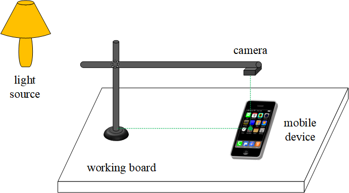
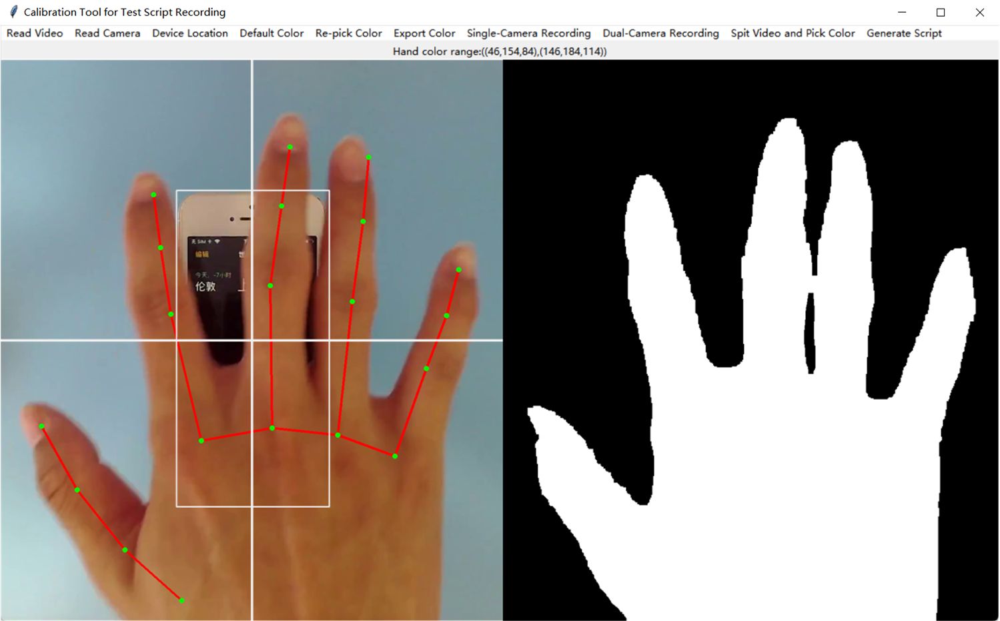
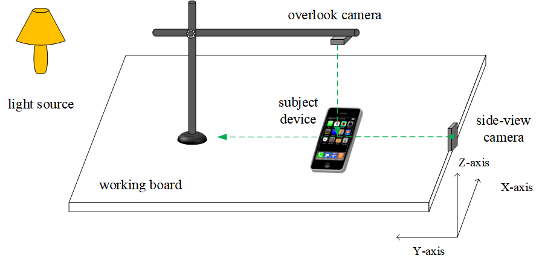
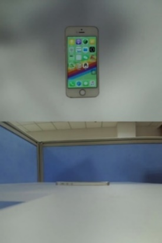
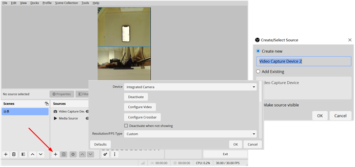
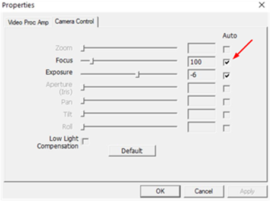

# **The Test Script Recording Guide**

The script recording is conducted under a camera shooting environment,and there are also some requirements for the GUI actions performed on a touch screen.

## 1. **The Single-Camera Recording**

The single-camera recording only supports click actions. Other actions can be performed but may be incorrectly recognized as clicks.

### 1.1 **Setting up the recording environment**

The single-camera recording environment consists of a working board, a camera stand, a camera, and a subject device under test. If a desk table\'s color does not overlap with the hand\'s, it can be used directly as the working board. The camera should be positioned overhead, directly above the device being tested.

Consider the following requirements or suggestions when setting up the recording environment.

- The working board should ideally have a solid color background that is distinct from both the skin color and the border color of the subject device under test, so that subsequent device area and hand detection are not interfered with.
  
- Control the camera's shooting height to ensure that during the hand color extraction via MediaPipe, the entire hand can be captured.
  
- Make sure that the device under test is fully, properly, and centrally displayed in the camera's view, without any distortion.
  
- Ensure the camera can clearly capture the icons and text on the device screen. If necessary, adjust and fix the camera\'s focus distance to focus on the screen (do not use autofocus during recording).
  
- Set the overhead camera to automatic exposure and turn off auto white balance to prevent dynamic color changes in the image from affecting skin tone detection.
  
- The entire testing environment should have regular and even lighting conditions to avoid the hand under the camera appearing too dark,and to prevent any part of the fingers from being too bright or too dark, which could affect the complete detection of the fingers.

### 1.2 **Detecting the hand color**

After setting up the environment, run the calibration tool (calibrate.py) to check the recording environment and extract the skin color range for hand detection.

(1) Configuring the camera shooting parameters

​      Under "Read Camera," click "Pick camera," "Set resolution," "Set camera parameters," etc., ensuring the camera parameters match those you will use for the final recording.

(2) Check the device position

​      Click "Device Location" on the toolbar to highlight the device location. The device under test should be upright and centered, with the camera focused near the screen. The entire hand shall be visible.

(3) Check the hand color detection.

​       Under "Read Camera," click "Start capturing." If, after a short time, the hand is recognized accurately, it indicates that the hand color has been extracted correctly. Otherwise, adjust the lighting, clear the surrounding environment, etc., to ensure more accurate hand recognition. Then, click "Re-pick Color" to run another hand color detection process.

(4) Export the hand color

​      Click "Export Color." The color data will be automatically saved in config/data.yaml, overwriting the original data.yaml. You can use the updated file to record test scripts.

  

 

### 1.3 **Instructions for human screen touches**

See the paper.

## 2. **The Dual-Camera Recording**

The dual-camera recording needs two cameras and can record many common touchscreen actions like double-clicks, swipes, long presses, drags, and
keyboard input in addition to the clicks.

### 2.1 **Setting up the recording environment**

The following figure illustrates the dual-camera recording environment. Compared with the single-camera approach, it adds a second camera to capture images from the side of a subject device.

Pay attention to the following requirements and suggestions for the side-view camera.

(1) Avoid backlighting. Ensure the camera lens is not facing any light sources, including lamps, room windows, etc.

(2) No objects with a skin-like color should appear in the side-view camera' vision.

(3) The entire side of the device under test should be visible, with the screen ideally positioned along the horizontal centerline of the image.

(4) Enable auto-exposure and disable auto white balance on the side-view camera.

(5) After autofocus, fix the side camera\'s focus distance (i.e., the focus should remain constant during the capture process).

Under the dual-camera approach, a recorded video comprises the views from two cameras (as shown in the following figure), with the upper half
representing the overlook view and the lower half representing the side view. The content from both cameras should be synchronized in time.

  

### 2.2 **Detecting the hand color**

The detection of hand color in the dual-camera approach is similar to the single-camera one. In addition to the overlook camera, now we also need to check the camera shooting of the side-view camera and verify whether the skin color for the side view is correctly obtained.

### 2.3 **Instructions for human screen touches**

See the paper.

## 3. **Recording Videos by OBS Studio**

We recommend using sophisticated tools like OBS Studio for video recording.

(1) Connect the cameras to the PC and then open the OBS Studio. Click the "+" button in the lower-left "Sources" panel to add the cameras. For the dual-camera approach, add both the overlook and side-view cameras.

(2) Set the video recording options, e.g., the shooting resolution and the frame rate.

(3) Adjust the camera shooting properties to ensure proper focus &mdash the top camera should clearly capture the device, while the side camera should clearly capture hand movements. Once focused, uncheck the "Auto" option for the focus (both cameras). Other properties must also be appropriately set according to the environmental requirements presented in the previous sections.

  

(4) Then click "Start Recording" on the right to begin the recording. Once the test operations have been finished, click "Stop Recording" to save the recorded video. The recorded video can be inputted into RoScript for processing.
